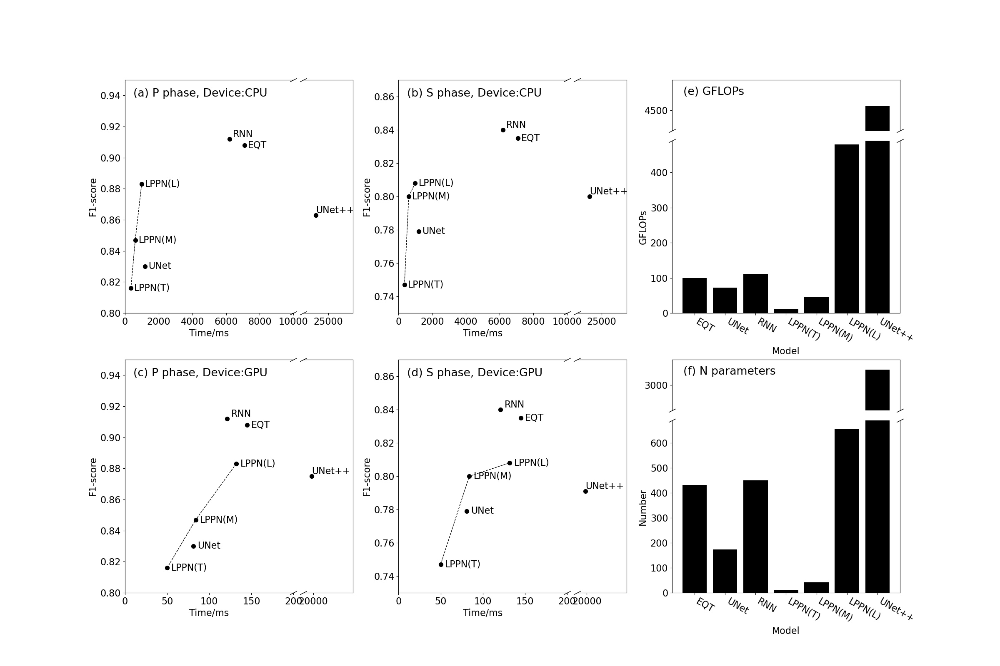
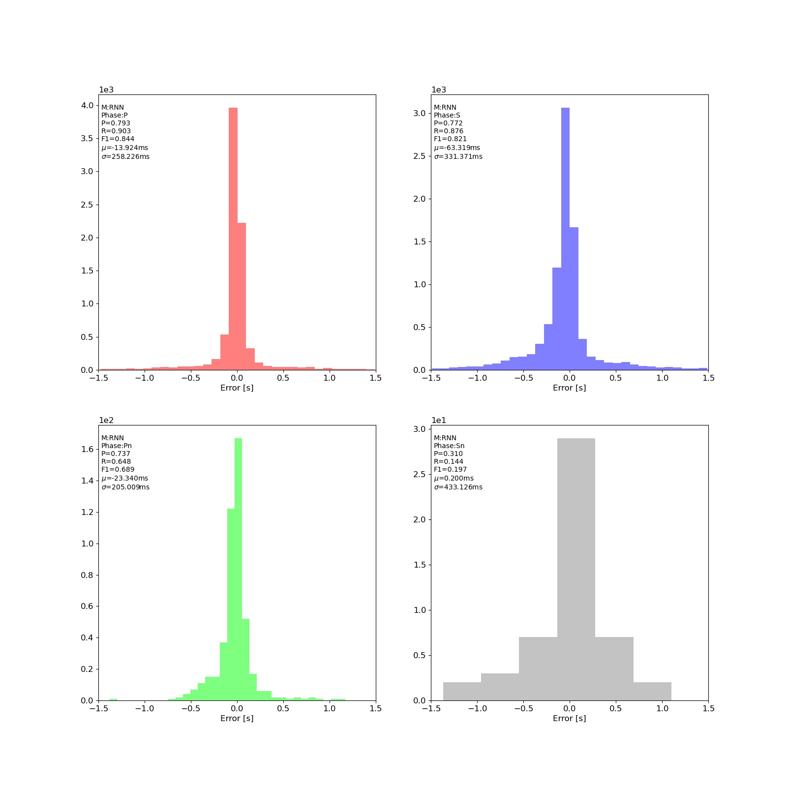

### 1. 全国100Hz模型使用说明
[Gitee项目地址](https://gitee.com/cangyeone/seismological-ai-tools/)

1. 训练数据，所有模型均是基于2009-2019全国地震台网训练的100Hz模型，模型可以直接用于连续数据拾取。
2. 模型训练数据为震中距为800km以内的台站，同时包含PS波的数据。
3. 目前已经基于ChinArray共三期数据进行了测试，RNN模型人工标注数据查全率不低于80%。
4. 不同模型精度和速度如图所示


#### 目前已开源模型
|模型名称|模型大小MB|P波F1Score|适用仪器|输入采样率|输入分量|训练数据震中距|使用范围|震相|
|:-:|:-:|:-:|:-:|:-:|:-:|:-:|:-:|:-:|
|BRNN|1.9|0.857|宽频带|100Hz|三分量|300km|全国|Pg、Sg|
|EQTrasformer|3.1|0.852|宽频带|100Hz|三分量|300km|全国|Pg、Sg|
|PhaseNet(UNet)|0.8|0.815|宽频带|100Hz|三分量|300km|全国|Pg、Sg|
|LPPN(Large)|2.7|0.813|宽频带|100Hz|三分量|300km|全国|Pg、Sg|
|LPPN(Medium)|0.4|0.808|宽频带|100Hz|三分量|300km|全国|Pg、Sg|
|LPPN(Tinny)|0.3|0.757|宽频带|100Hz|三分量|300km|全国|Pg、Sg|
|UNet++|12|0.798|宽频带|100Hz|三分量|300km|全国|Pg、Sg|
|BRNN(PnSn)|1.9|0.781|宽频带、速度计、加速度计|100Hz|三分量|2000km|全球|Pg、Sg、Pn、Sn|
|tele(远震拾取模型)|1.9|0.800|宽频带|20Hz|三分量|>3000km|全球|P|
|BRNN(单分量)|1.9|0.807|宽频带|100Hz|任意分量|300km|全国|Pg、Sg|

#### 1.1 推荐模型：
1. 如果更加看重精度可使用RNN，我们在全国范围内的流动台网、密集台网、固定台网上均进行了测试。
2. 如果内存有限，更加看重速度可以使用LPPNM。
3. 如果查全率较低，我们推荐使用0.1为阈值（pickers/rnn.01.jit），或者使用PnSn模型。虽然测试中F1比较低，这是由于测试中使用的2000km以内的人工标注数据测试导致的。
4. 一些任务中需要输出每个采样点的置信度，这可以使用onnx模型。

#### 1.2 Pn和Sn震相拾取摸模型
1. 为了使得模型更加具有通用性，我们使用2000km所有人工标注数据训练了新的模型
2. 模型为rnn.pnsn.jit
3. 基于RNN模型，可以同时拾取P，S，Pn，Sn震相 
4. 其他代码请访问Gitee项目地址
5. 由于数据是非均衡的，并且有些震相标注缺失，导致置信度偏低，目前设置置信度阈值为0.1 
6. 模型可供pickers.py调用，直接遍历目录自动拾取，见4.1节
7. 数据需要是100Hz采样的
8. 目前精度未充分测试，仅截取了2020年2000km内10000条102.4秒的波形数据进行了测试，测试结果如图
9. 我们发现数据差分（高通滤波）后对于大地震拾取效果更好，因此我们制作了原始+差分数据拾取的模型，示例为makejit.pnsn.diff.py。输出模型为：rnn.origdiff.pnsn.jit 



调用方式
```python 
import torch 
sess = torch.jit.load("rnn.pnsn.jit")
x = ... # [任意长度, 3] 
# 需要将数据转换为torch格式
with torch.no_grad():
    x = torch.tensor(x, dtype=torch.float32, device=device) 
    y = sess(x) 
    phase = y.cpu().numpy()# [震相数量, 1P, 2S, 3Pn, 4Sn]
```

#### 1.3 远震拾取模型
我们新添加了用于远震拾取的模型tele.rnn.jit。用于远震PS震相拾取。


### 2. 模型使用说明
我们提供了三种类型的模型文件：
1. .pt文件在ckpt文件夹中，其可以用于迁移学习，方便迁移到地方数据之上。迁移训练中建议固定部分可训练参数。
2. 用于任意长度拾取的模型在pickers文件夹下
   1. .jit供pytorch直接调用，可以直接输出震相相对到时和震相类型信息。
   2. .onnx供onnxruntime库调用，其比pytorch更加轻量化，适合于边缘设备上进行拾取。由于提供的API较为简单，后处理过程需要在外部进行。

- .jit文件输出格式为：[震相数量，震相类型+相对到时+置信度]，所有jit文件均是如此。震相类型：1:P,2:S。
- .onnx输出有两个，一个概率prob，一个时间time，比如prob[i]代表了第i个点不同震相类型的概率，是一个长度为3的向量；time[i]代表了第i个点的相对时刻。time和prob需要配合使用才能进行拾取。
- .jit使用示例见picker.jit.py
- .onnx使用示例见picker.onnx.py

#### 2.1 使用C语言版onnx模型
由于C语言程序写起来比较复杂，我们将onnx输出中的time和prob进行了合并，形成了.merge.onnx版模型，模型输出向量格式为：
[
    [时间长度,类别数量,-,-], 
    [类别数量,噪声概率,P波概率,S波概率],
    [采样点,噪声概率,P波概率,S波概率], 
    .....
]
C语言版示例程序可以联系cangye@hotmail.com。或者QQ305601470。


需要注意的是：
1. 所有拾取模型均不需要数据预处理
2. 特别是不要滤波

### 3. 制作onnx和jit文件
示例程序见makeonnx.xxx.jit和makejit.xxx.jit。、
.jit文件中
```python
time_sel = torch.masked_select(ot, pc>0.3)
score = torch.masked_select(pc, pc>0.3)
```
0.3为最小置信度，目前来看其是比较合理的，如果想拾取更多震相（同时错误更多）可以降低取值。
```python
selidx = torch.masked_select(selidx, torch.abs(ref-ntime)>1000)
nprob = torch.masked_select(nprob, torch.abs(ref-ntime)>1000)
ntime = torch.masked_select(ntime, torch.abs(ref-ntime)>1000)
```
1000代表1000个采样点，其含义为长度为1000的时窗中仅拾取同一类型概率最大的一个震相，如果认为10秒内可能有多个震相，可以降低取值。

**onnx模型由于后处理在模型之外，因此可以使用config/picker.py来进行**

### 4. 直接拾取连续数据
#### 4.1 震相拾取
我们提供了更加方便的方式可以直接遍历目录并拾取所有震相。
```bash 
python picker.py -i 数据目录 -o 输出文件名 -m pickers/rnn.jit -d 计算设备
```
程序可以自动遍历目录，文件命名方式在config\picker.py中设置。
输出文件可以随时终止，中断后会从断点开始。
输出文件有两个：
1. 输出文件名.txt 包含所有拾取震相 
2. 输出文件名.log 包含已处理数据信息
3. 输出文件名.err 包含问题数据信息

输出文件格式为：
```text
#path/to/file
phase name,relative time(s),confident,aboulute time(%Y-%m-%d %H:%M:%S.%f),SNR,AMP,station name,other information 
```

#### 4.2 震相关联
关联目标为从震相拾取结果中确定地震数量、位置、发震时刻信息。
震相关联目前提供了两个关联算法：
1. REAL methods [reallinker.py]
2. LPPN methods [fastlinker.py]

两个模型均以拾取结果作为输入
```bash 
python fastlinker.py -i 震相拾取结果.txt -o 输出文件名.txt -s 台站目录
```

台站文件格式为:
```text
台网名 台站名 LOC 经度 纬度 高程（m） 
```

比如:
```
SC AXX 00 110.00 38.00 1000.00
```

输出关联文件结构为
```text
##EVENT,TIME,LAT,LON,DEP
##PHASE,TIME,LAT,LON,TYPE,PROB,STATION,DIST,DELTA,ERROR
#EVENT,2022-04-09 02:28:38.021000,100.6492,25.3660,0.0000
PHASE,2022-04-09 02:28:40.249700,100.5690,25.2658,P,0.958,MD.01311,13.753,2.229,-0.139
PHASE,2022-04-09 02:28:41.929700,100.5690,25.2658,S,0.621,MD.01311,13.753,3.909,-0.238
```

台站目录格式请参考代码

#### 论文引用
请引用论文：
1. LPPN: A Lightweight Network for Fast Phase Picking,https://doi.org/10.1785/0220210309
2. Yu ZY, Wang WT and Chen YN (2022). Benchmark on the accuracy and efficiency of several neural network based phase pickers using datasets from china seismic network. Earthq Sci 35, doi:  10.1016/j.eqs.2022.10.001
### 开源许可证
GPLv3 

