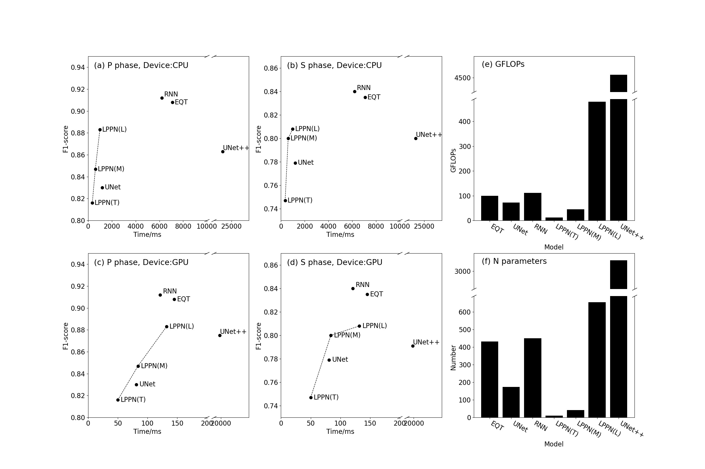

> This repository provides seismic event detection methods based on the **PnSn phase picker**, together with a set of auxiliary tools for seismic phase picking, phase association, and earthquake event detection. For detailed documentation, usage examples, and model descriptions, please refer to: [https://github.com/cangyeone/pnsn](https://github.com/cangyeone/pnsn)


## Seismic Phase Detection Models

This directory collects pre-trained neural networks for seismic phase detection that operate on 100 Hz waveform data from the Chinese national seismic network. All models can be applied directly to continuous waveform archives for automated picking of P- and S-wave arrivals, and several extend the phase set to include teleseismic and upper-mantle arrivals.

The models were trained on recordings from 2009–2019. Training examples are drawn from stations within 800 km of the epicentre (unless otherwise noted) and include manually labelled P and S phases. During validation the recurrent neural network (RNN) models achieved at least 80% recall on manually labelled phases in three test regions of the ChinArray dataset. Accuracy and runtime benchmarks for the major architectures are summarised below and illustrated in `pickers/speed.jpg`.



### Released Models and Accuracy

| Model | Size (MB) | P-phase F1 | Instrument | Sampling Rate | Channel | Max Distance | Coverage | Output Phases |
| :---: | :-------: | :--------: | :--------: | :-----------: | :-----: | :----------: | :------: | :-----------: |
| BRNN | 1.9 | 0.857 | Broadband | 100 Hz | EHZ | 300 km | Global | Pg, Sg |
| EQTransformer | 3.1 | 0.852 | Broadband | 100 Hz | EHZ | 300 km | Global | Pg, Sg |
| PhaseNet (UNet) | 0.8 | 0.815 | Broadband | 100 Hz | EHZ | 300 km | Global | Pg, Sg |
| LPPN (Large) | 2.7 | 0.813 | Broadband | 100 Hz | EHZ | 300 km | Global | Pg, Sg |
| LPPN (Medium) | 0.4 | 0.808 | Broadband | 100 Hz | EHZ | 300 km | Global | Pg, Sg |
| LPPN (Tiny) | 0.3 | 0.757 | Broadband | 100 Hz | EHZ | 300 km | Global | Pg, Sg |
| UNet++ | 12 | 0.798 | Broadband | 100 Hz | EHZ | 300 km | Global | Pg, Sg |
| BRNN (PnSn) | 1.9 | 0.781 | Broadband & MEMS | 100 Hz | EHZ | 2000 km | Global | Pg, Sg, Pn, Sn |
| tele | 1.9 | 0.800 | Broadband | 20 Hz | EHZ | >3000 km | Global | P |
| BRNN (Any ch.) | 1.9 | 0.807 | Broadband | 100 Hz | Any | 300 km | Global | Pg, Sg |

**Model selection guidance**

1. **Highest accuracy:** Use the BRNN-based pickers. They have been evaluated on mobile, dense, and permanent networks around the globe.
2. **Memory-constrained deployments:** Choose the lightweight LPPN models, particularly the medium or tiny variants, which trade a small amount of accuracy for reduced size and faster inference.
3. **Improving recall:** Lower the detection threshold to 0.1 using `pickers/rnn.01.jit`, or use the Pn/Sn-capable RNN model for regions with significant upper-mantle phases.
4. **Confidence curves:** Deploy the ONNX exports to obtain per-sample probability curves that can be post-processed downstream.

### Pn and Sn Phase Detection

To extend applicability beyond regional Pg/Sg arrivals, the `rnn.pnsn.jit` model was trained on 2000 km manually labelled data and detects P, S, Pn, and Sn phases simultaneously. The input must be sampled at 100 Hz. Because of class imbalance and incomplete labelling, a confidence threshold of 0.1 is recommended. The model can be invoked through `pickers.py` (see [Running Phase Picking](#running-phase-picking)).

Only limited validation has been completed so far—10,000 waveforms of 102.4 seconds recorded within 2000 km during 2020. Performance on this set is illustrated in `pickers/china.pnsn.jpg`. Differentiated (high-pass filtered) traces improve large-earthquake picks, and `makejit.pnsn.diff.py` demonstrates how to train the combined original/differentiated variant (`rnn.origdiff.pnsn.jit`).

```python
import torch

session = torch.jit.load("rnn.pnsn.jit")
waveform = ...  # Tensor with shape [N, 3]

with torch.no_grad():
    inputs = torch.tensor(waveform, dtype=torch.float32, device=device)
    outputs = session(inputs)
    # outputs: [num_detections, phase_type, relative_time, confidence]
    picks = outputs.cpu().numpy()
```

### Teleseismic Phase Detection

The `tele.rnn.jit` model targets distant earthquakes, focusing on teleseismic P-wave arrivals in 20 Hz broadband recordings. It can be processed with the same utilities as the regional models.

## Using the Models

We distribute three formats for each architecture:

1. **Checkpoint files (`ckpt/*.pt`)** – Use for fine-tuning on local data. When performing transfer learning, we recommend freezing a subset of the parameters to preserve the learned feature extractors.
2. **TorchScript pickers (`pickers/*.jit`)** – Run directly with PyTorch. These models output a list of detections in the format `[phase_type, relative_arrival_time, confidence]`, enabling immediate downstream processing.
3. **ONNX exports (`pickers/*.onnx`)** – Execute with `onnxruntime` for lightweight or edge deployments. ONNX models expose two arrays:
   - `prob`: per-sample class probabilities (noise, P, S).
   - `time`: per-sample relative arrival times.

Example usage is provided in `picker.jit.py` and `picker.onnx.py`. For ONNX-based pipelines, combine `prob` and `time` to determine picks. The helper script `config/picker.py` contains reference post-processing routines that convert probability curves into discrete picks.

### C-Compatible ONNX Merge Format

To simplify C-language integration, merged ONNX models (`*.merge.onnx`) embed both probability and timing information in a single tensor with the structure:

```
[ [time_length, num_classes, -, -],
  [num_classes, P(noise), P(P), P(S)],
  [sample_index, P(noise), P(P), P(S)],
  ... ]
```

For example programs in C, please contact `cangye@hotmail.com`.

## Exporting New TorchScript or ONNX Models

The scripts `makejit.*.py` and `makeonnx.*.py` illustrate how to export new pickers. Within the TorchScript exporters you will find post-processing thresholds such as:

```python
time_sel = torch.masked_select(ot, pc > 0.3)
score = torch.masked_select(pc, pc > 0.3)
```

The `0.3` threshold is the default minimum confidence. Lower it to return more candidate phases (with a higher false-alarm rate).

```python
selidx = torch.masked_select(selidx, torch.abs(ref - ntime) > 1000)
nprob = torch.masked_select(nprob, torch.abs(ref - ntime) > 1000)
ntime = torch.masked_select(ntime, torch.abs(ref - ntime) > 1000)
```

The window of 1,000 samples (~10 seconds at 100 Hz) suppresses duplicate picks of the same phase. Reduce this value if you expect multiple arrivals of the same type within shorter windows.

## Running Phase Picking

Use `picker.py` to traverse waveform directories and write pick files:

```bash
python picker.py -i path/to/data -o output_name -m pickers/rnn.jit -d device
```

The script produces three outputs:

1. `output_name.txt` – all detected phases.
2. `output_name.log` – processing log.
3. `output_name.err` – problematic waveforms.

Each entry in the main results file follows the format:

```
#path/to/file
phase_name,relative_time_s,confidence,absolute_time(%Y-%m-%d %H:%M:%S.%f),SNR,AMP,station,extra_info
```

## Seismic Association Workflows

After picking phases, associate them into events using one of the provided algorithms:

1. **REAL** – `reallinker.py`
2. **LPPN** – `fastlinker.py`
3. **GaMMA** – `gammalinker.py`

Each tool consumes the picker output described above. For example, to run the LPPN associator:

```bash
python fastlinker.py -i phase_picking_results.txt -o output_file_name.txt -s station_directory
```

Station metadata files must follow the format:

```
network station LOC longitude latitude elevation_m
```

Example:

```
SC AXX 00 110.00 38.00 1000.00
```

The association result file is structured as:

```
##EVENT,TIME,LAT,LON,DEP##
PHASE,TIME,LAT,LON,TYPE,PROB,STATION,DIST,DELTA,ERROR#
EVENT,2022-04-09 02:28:38.021000,100.6492,25.3660,PICKED_PHASE_TIME_LAT_LON_TYPE_PROB_STATION_DIST_DELTA_ERROR#
PHASE_PICKED_TIME_LAT_LON_TYPE_PROB_STATION_DIST_DELTA_ERROR#
```

Refer to the individual scripts for additional configuration options.

## Citations

If you use these models, please cite:

1. **LPPN:** *A Lightweight Network for Fast Phase Picking*. https://doi.org/10.1785/02202103092
2. **Benchmark study:** Yu, Z. Y., Wang, W. T., & Chen, Y. N. (2022). *Benchmark on accuracy and efficiency of several neural network based phase pickers using datasets from China seismic network*. *Earthquake Science, 35*. https://doi.org/10.1016/j.eqs.2022.10.001

## License

GPLv3
