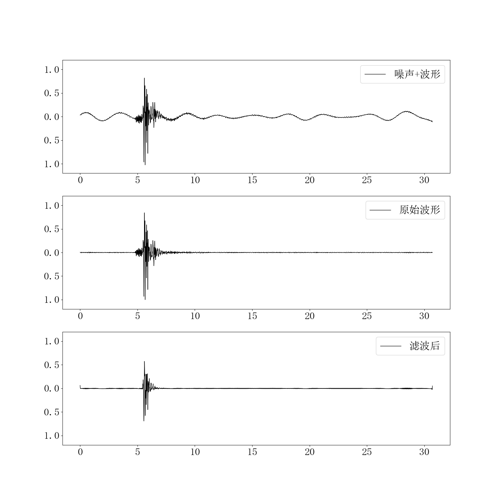

### 地震波形去噪程序
使用STEAD数据集训练的去噪网络

### 训练
程序较为简单，可以直接阅读代码。包含两个训练代码：
1. train.py，使用编码解码结构用于波形去噪
2. trainwithpick.py，结合震相拾取模型训练，使得滤波后依然可以保证拾取PS震相。

数据文件放在data文件夹中，stead数据集中包含两个：
- data/waveforms_11_13_19.hdf5 
- data/metadata_11_13_19.csv